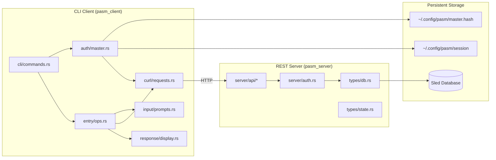
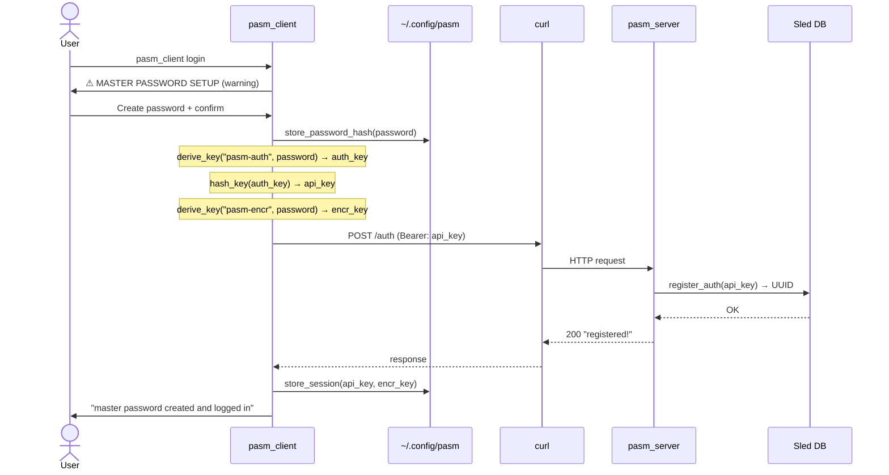
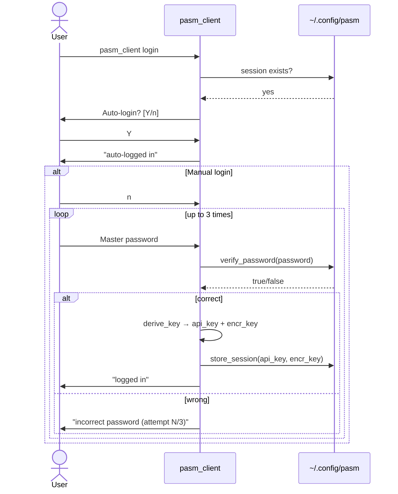
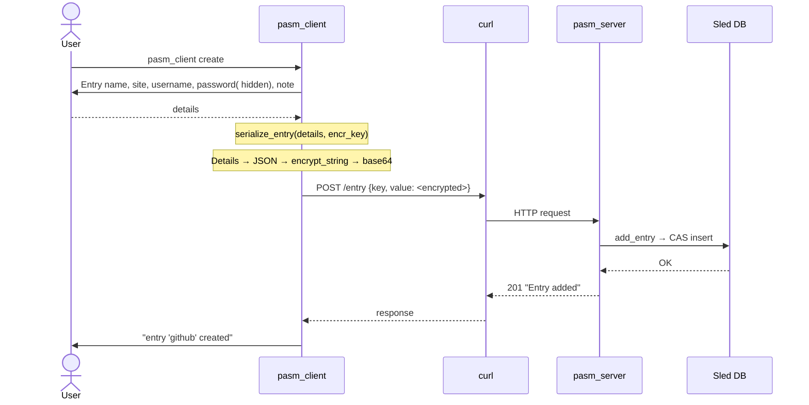
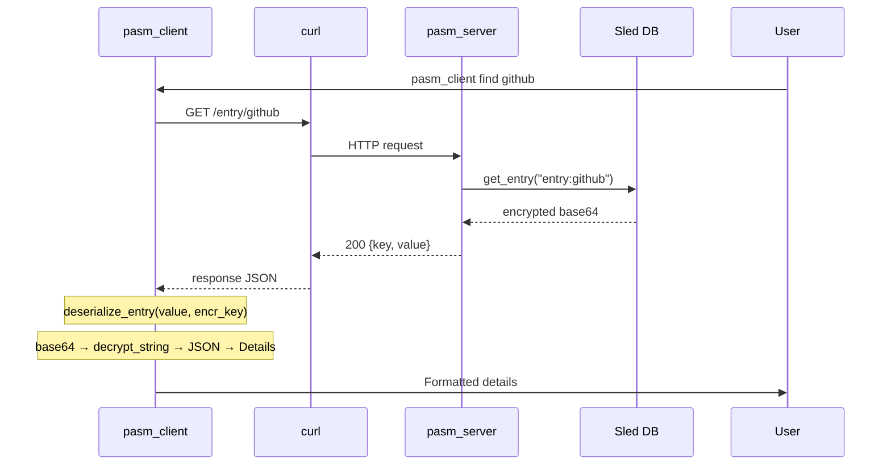
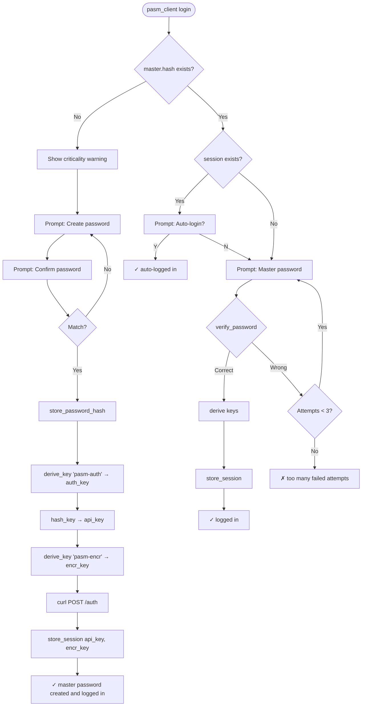
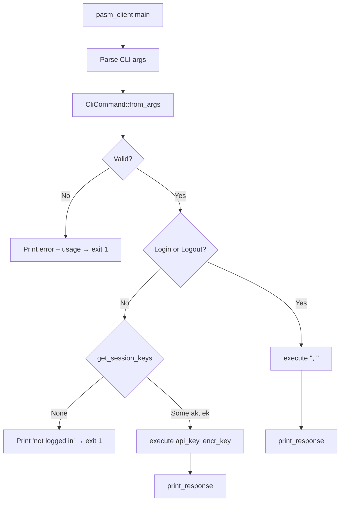

---
tags:
  - pasm
  - architecture
  - walkthrough
created: 2026-05-30
---

# pasm — Full Architecture Walkthrough

> A minimal password manager with an Axum REST API backend and a CLI client frontend.

---

## Table of Contents

1. [[#Session Recap — What We Did]]
2. [[#High-Level Architecture]]
3. [[#System Flow]]
4. [[#Code Map]]
5. [[#Client Internals]]
6. [[#Server Internals]]
7. [[#Security Model]]
8. [[#Weak Points]]
9. [[#Upgrade Roadmap]]
10. [[#Data Flow Diagrams]]

---

## Session Recap — What We Did

### Round 1: From TUI to CLI

Replaced the ratatui/crossterm TUI with a clean CLI interface. Created modular client structure:

| Module | Responsibility |
|--------|---------------|
| `client/cli/commands.rs` | CLI argument parsing, command dispatch |
| `client/curl/requests.rs` | All HTTP request builders (wraps `curl`) |
| `client/response/display.rs` | Output formatting (JSON pretty-print, colored) |
| `client/auth/master.rs` | Login/logout, password hashing, session management, key derivation |
| `client/entry/ops.rs` | Entry CRUD with encrypt/decrypt orchestration |
| `client/input/prompts.rs` | Interactive user input (visible + hidden) |

### Round 2: Master Password & Key Derivation

- Added `sha2` dependency for SHA-256
- Two-zone key derivation: `api_key` for auth, `encr_key` for encryption
- Password verification via MagicCrypt encrypt/decrypt of known plaintext
- Session file (`~/.config/pasm/session`) stores both keys with 0600 perms
- Login flow with auto-login detection and 3-attempt retry

### Round 3: Registration Wiring

- First-time login calls `POST /auth` to register the derived `api_key` on the server
- Auto-registration only on first login; subsequent logins skip it

### Round 4: Audit & Fixes

Produced [[pasm-audit.md]] cataloguing 10 loose ends + 8 security recommendations. Then fixed:

| Fix | What | Impact |
|-----|------|--------|
| **EchoGuard** | `Drop` guard restores `stty echo` on panic | Terminal never left broken |
| **Registration error** | Warns on transport failure instead of silent ignore | User knows API calls may fail |
| **`update_auth`/`remove_auth`** | Replaced stubs with real curl calls | Actual key rotation and user deletion |
| **Server `amend_entry`** | Fixed key format to use `entry:` prefix | Amend now finds the same entries as find/delete |
| **`entry:` prefix** | Stripped in list display | Cleaner output for users |
| **Hidden password** | Entry creation uses hidden prompt | Password not visible on screen |
| **`SERVER_URL` constant** | Extracted hardcoded URL | Single change point |
| **Curl stderr** | Captured on transport failure | Better error messages |

### Round 5: Documentation

Added `///` doc comments to every function across 14 files — ~1300 lines of docs covering arguments, return values, caveats, and edge cases.

---

## High-Level Architecture



### Two-Binary Architecture

```
pasm/
├── src/bin/pasm_client.rs   ← User-facing CLI
└── src/bin/pasm_server.rs   ← REST API server
```

They communicate exclusively over HTTP. The client shells out to `curl`; the server runs Axum on `0.0.0.0:3000`. There is no shared state — the database is only on the server side.

---

## System Flow

### First-Time Setup



### Subsequent Login



### Creating an Entry



### Finding an Entry



---

## Code Map

### Directory Tree

```
src/
├── bin/
│   ├── pasm_client.rs          Entry point — parse args, dispatch
│   └── pasm_server.rs          Entry point — start Axum server
│
├── client/
│   ├── mod.rs                  pub mod declarations
│   ├── auth/
│   │   ├── mod.rs
│   │   └── master.rs           Login, logout, key derivation, session mgmt
│   ├── cli/
│   │   ├── mod.rs
│   │   └── commands.rs         CliCommand enum, parsing, dispatch
│   ├── curl/
│   │   ├── mod.rs
│   │   └── requests.rs         All curl request builders
│   ├── entry/
│   │   ├── mod.rs
│   │   └── ops.rs              Entry CRUD with encrypt/decrypt
│   ├── input/
│   │   ├── mod.rs
│   │   └── prompts.rs          Interactive prompts, EchoGuard
│   └── response/
│       ├── mod.rs
│       └── display.rs          Output formatting
│
├── server/
│   ├── mod.rs                  Route setup, server::run()
│   ├── auth.rs                 Bearer token middleware
│   └── api/
│       ├── mod.rs              pub mod declarations
│       ├── auth/
│       │   ├── mod.rs
│       │   ├── register.rs     POST /auth
│       │   ├── update.rs       POST /auth/update
│       │   └── remove.rs       DELETE /auth/remove
│       ├── amend.rs            POST /entry/amend
│       ├── create.rs           POST /entry
│       ├── delete.rs           DELETE /entry/{name}
│       ├── find.rs             GET /entry/{name}
│       ├── list.rs             GET /entries
│       └── users.rs            GET /auth/list
│
├── types/
│   ├── mod.rs
│   ├── db.rs                   PasmDb wrapper — all Sled operations
│   ├── detail.rs               Details struct (name, site, uname, pword, note)
│   ├── entry.rs                RequestData struct (key, value)
│   ├── error.rs                PasmResult enum — unified error type
│   └── state.rs                PasmState (holds PasmDb)
│
└── utils/
    ├── mod.rs
    ├── encrypt.rs              encrypt_string() — AES-256 via MagicCrypt
    ├── decrypt.rs              decrypt_string() — base64 → AES-256 → plaintext
    ├── serialize.rs            serialize_entry() — Details → JSON → encrypt
    └── deserialize.rs          deserialize_entry() — decrypt → JSON → Details
```

### Key Types

| Type | Location | Purpose |
|------|----------|---------|
| `PasmResult` | `types/error.rs` | Unified error enum (7 variants) with `Display` and `IntoResponse` |
| `PasmState` | `types/state.rs` | Axum app state (holds `PasmDb`) |
| `PasmDb` | `types/db.rs` | Sled database wrapper (users tree + per-user entry trees) |
| `Details` | `types/detail.rs` | Entry data: name, site, uname, pword, note |
| `RequestData` | `types/entry.rs` | HTTP payload: `{key, value}` |
| `SessionData` | `auth/master.rs` | Session JSON: `{api_key, encr_key}` |
| `CliCommand` | `cli/commands.rs` | CLI command enum (12 variants) |
| `EchoGuard` | `input/prompts.rs` | Drop guard restoring `stty echo` |

---

## Client Internals

### Key Derivation

```rust
// Two independent keys from one password:
auth_key   = SHA-256("pasm-auth" || password)     // 64-char hex
api_key    = SHA-256(auth_key)                     // 64-char hex (sent to server)
encr_key   = SHA-256("pasm-encr" || password)      // 64-char hex (never leaves client)
```

The double-hash for `api_key` ensures the raw `auth_key` derivation output is never transmitted. If the server is compromised, an attacker learns `api_key` but still cannot reverse it to derive `encr_key` or the master password.

### Session File

Path: `$HOME/.config/pasm/session`
Permissions: `0600` (owner read/write only)

```json
{
  "api_key": "abc123...64chars",
  "encr_key": "def456...64chars"
}
```

### Password Verification

Instead of storing a password hash, the system encrypts a known plaintext (`"pasm::verify"`) using the password as the MagicCrypt key. Verification is decrypt-and-compare:

```
store: ciphertext = AES-256(password, "pasm::verify")
check: "pasm::verify" == AES-256(password, ciphertext)
```

This avoids adding a KDF dependency but has [[#Password verification via MagicCrypt|caveats]].

---

## Server Internals

### Route Table

| Method | Route | Handler | Auth | Description |
|--------|-------|---------|------|-------------|
| `POST` | `/auth` | `register::call` | None | Register new auth key → UUID |
| `GET` | `/auth/list` | `users::call` | Bearer | List all registered auth keys |
| `POST` | `/auth/update` | `update::call` | Bearer | Replace auth key (key rotation) |
| `DELETE` | `/auth/remove` | `remove::call` | Bearer | Delete user + all entries |
| `POST` | `/entry` | `create::call` | Bearer | Create entry (CAS, no overwrite) |
| `POST` | `/entry/amend` | `amend::call` | Bearer | Upsert entry (overwrites existing) |
| `GET` | `/entry/{name}` | `find::call` | Bearer | Get single encrypted entry |
| `DELETE` | `/entry/{name}` | `delete::call` | Bearer | Delete single entry |
| `GET` | `/entries` | `list::call` | Bearer | List all encrypted entries |

### Database Layout

```
users tree:
  "<api_key>" → "<UUID>"         # Auth key → user ID mapping

<UUID> tree:
  "entry:github"  → "<base64>"   # Encrypted entry data
  "entry:gmail"   → "<base64>"
  ...
```

Each authenticated user gets their own Sled tree named by UUID. Auth middleware checks `users.contains_key(api_key)` and inserts the key as an `Extension` for handlers.

### Auth Middleware

`src/server/auth.rs`:

1. Extract `Authorization: Bearer <token>` header
2. Look up token in `users` Sled tree
3. If found, insert token into request extensions → downstream handlers extract via `Extension<String>`
4. If not found, return `401 UNAUTHORIZED`

---

## Security Model

### Trust Boundaries

```
[User] → [Client CLI] ──── HTTP ──── [Server] ──── [Sled DB]
   │                            │                      │
   │                            │                      │
   ▼                            ▼                      ▼
master.hash               TLS (optional)           Disk encryption
session (0600)            Bearer token             (OS-level)
```

### What Protects What

| Asset | Protection | Weakness |
|-------|-----------|----------|
| Master password | Not stored on disk; only encrypted verification | MagicCrypt ≠ KDF; offline brute-force possible |
| Entry data | AES-256 encrypted before leaving client | `encr_key` stored in session file |
| API access | Bearer token (SHA-256 derived) | Token stored in session file |
| Server database | No server-side encryption | Sled DB is raw on disk |

---

## Weak Points

### 🔴 Critical

| # | Issue | Impact | Why |
|---|-------|--------|-----|
| W1 | **No key stretching** | Offline brute-force of master password | `master.hash` uses MagicCrypt (fast AES), not Argon2id/PBKDF2. An attacker with the file can try ~10⁶ passwords/sec. |
| W2 | **encr_key in plaintext session** | Full vault compromise from session file | `~/.config/pasm/session` has `0600` but a single compromise reveals both API access AND decryption keys |
| W3 | **No TLS** | Credentials in cleartext on network | All HTTP, no HTTPS. Anyone on the same network can capture Bearer tokens and entry data |

### 🟡 Medium

| # | Issue | Impact |
|---|-------|--------|
| W4 | **Shells out to `curl`** | External dependency; no HTTP status code handling; stderr was lost until fix |
| W5 | **Session file = single point of compromise** | No second factor; no OS keyring integration |
| W6 | **No entry-level access control** | Any authenticated user can list/delete all their own entries — no granular permissions |
| W7 | **Server stores data in cleartext** | Database files on disk are not encrypted at the application layer |
| W8 | **No rate limiting** | Brute-force of auth tokens or passwords at the API level |
| W9 | **Amend uses upsert semantics** | `POST /entry/amend` silently overwrites or creates entries — no confirmation |

### 🟢 Low

| # | Issue | Impact |
|---|-------|--------|
| W10 | **No input validation** | Empty names, malformed JSON, etc. may produce confusing errors |
| W11 | **No lockout on server** | Auth brute-force limited only by network latency |
| W12 | **Master password recovery impossible** | By design (criticality warning shown on setup), but users WILL lose data |
| W13 | **No export/import** | Data is trapped in Sled; no migration path |
| W14 | **`stty` Unix-only** | Hidden prompts fail on Windows (no `stty`) |

---

## Upgrade Roadmap

### P0 — Security (do first)


| Step | Description | Effort | Risk |
|------|-------------|--------|------|
| **Argon2id** | Replace MagicCrypt password verification with `argon2` crate. Store salt + hash in `master.hash`. | Medium | Changes login file format; existing users need migration |
| **Derive encr_key per-session** | Don't store `encr_key` in session. Accept the UX hit: re-enter password on each `login()`. | Small | Breaks auto-login convenience |
| **OS keyring** | Store `api_key` in OS keyring (secret-service, keychain, etc.) via `keyring` crate. | Medium | Platform-specific; adds dependency |
| **TLS** | Generate self-signed cert, add Axum TLS listener, accept cert fingerprint on first connection. | Small | Need cert management UX |

### P1 — Reliability

| Step | Description | Effort |
|------|-------------|--------|
| **Replace curl with reqwest** | Pure-Rust HTTP client; proper error handling, status codes, streaming | Medium |
| **EchoGuard for Windows** | Use `crossterm` or WinAPI to disable echo instead of `stty` | Small |
| **Error recovery** | Handle server 404/409/500 properly in client (currently shows raw response) | Small |
| **Configurable server URL** | Env var `PASM_SERVER` with `http://localhost:3000` fallback | Tiny |

### P2 — UX

| Step | Description | Effort |
|------|-------------|--------|
| **Export/import** | Dump all entries to encrypted JSON; import from same format | Medium |
| **Server-side entry encryption** | Encrypt values at rest in Sled (requires server key management) | Large |
| **Rate limiting** | Add tower middleware for request rate limiting | Small |
| **Colored output toggle** | `--no-color` flag or `NO_COLOR` env var support | Tiny |

### P3 — Features

| Step | Description | Effort |
|------|-------------|--------|
| **Entry categories/tags** | Add `tags` field to `Details`, filter by tag in `list` | Medium |
| **Password generator** | Generate random password during `create` instead of typing | Small |
| **Clipboard integration** | Copy password to clipboard (via `xclip`/`wl-clipboard` or `arboard` crate) | Small |
| **TOTP support** | Store TOTP seed, generate 2FA codes | Large |

---

## Data Flow Diagrams

### Full Login Lifecycle



### Entry CRUD Encryption Flow

```mermaid
flowchart TD
    subgraph CREATE ["Create / Amend"]
        A1[collect_details] --> A2[Details struct]
        A2 --> A3[serde_json::to_string]
        A3 --> A4[encrypt_string → base64]
        A4 --> A5[curl POST → server]
        A5 --> A6[store in Sled]
    end

    subgraph FIND ["Find / List"]
        B1[curl GET → server] --> B2[JSON response]
        B2 --> B3[extract value field]
        B3 --> B4[decrypt_string → plaintext JSON]
        B4 --> B5[serde_json::from_str → Details]
        B5 --> B6[format & display]
    end

    subgraph DELETE ["Delete"]
        C1[curl DELETE → server] --> C2[remove from Sled]
        C2 --> C3[display response]
    end
```



### Client Dispatch



---

## Key Design Decisions

### Why SHA-256 instead of Argon2id?

Added `sha2` as a minimal dependency (pure Rust, no C bindings) to get key derivation working quickly. Argon2id requires a larger dependency and changes the password storage format, so it was deferred as a future upgrade.

### Why MagicCrypt for password verification?

MagicCrypt provides symmetric encrypt/decrypt with a simple API. Using `encrypt("pasm::verify")` as a password check avoids storing a reversible hash — an attacker needs the password to decrypt. However, MagicCrypt uses AES-256 directly without key stretching (fast to brute-force), which is why Argon2id is recommended as [[pasm-audit.md#S1|S1]].

### Why `curl` instead of `reqwest`?

Shelling out to `curl` required zero additional Rust dependencies. The tradeoffs:
- **Pro**: No HTTP client library to manage
- **Con**: External binary dependency, no status code access, stderr was silently discarded (now fixed)
- **Con**: No async HTTP, serial process spawn per request

### Why two separate binaries?

The server needs async runtime (Tokio + Axum + Sled) while the client is a simple synchronous CLI. Combining them would:
- Increase client compile time (all server deps would be linked)
- Make the binary much larger
- Couple server and client release cycles

They share the `types` and `utils` modules via `lib.rs`, so the encryption scheme and data structures are guaranteed consistent.

---

## Files Changed This Session

```
New files:
  src/client/auth/master.rs         Full login/logout/key derivation
  src/client/auth/mod.rs            Module declaration
  src/client/cli/commands.rs        CliCommand enum, parsing, dispatch
  src/client/cli/mod.rs             Module declaration
  src/client/curl/mod.rs            Module declaration
  src/client/curl/requests.rs       All curl builders + SERVER_URL + stderr fix
  src/client/entry/mod.rs           Module declaration
  src/client/entry/ops.rs           Entry CRUD + encrypt/decrypt wiring
  src/client/input/mod.rs           Module declaration
  src/client/input/prompts.rs       Interactive prompts + EchoGuard
  src/client/response/mod.rs        Module declaration
  src/client/response/display.rs    Output formatting
  pasm-audit.md                     Audit & recommendations
  pasm-walkthrough.md               This document

Modified files:
  Cargo.toml                        Added sha2, removed ratatui/crossterm
  Cargo.lock                        Updated dependencies
  README.md                         Rewritten for CLI + server docs
  src/lib.rs                        Added client module
  src/client/mod.rs                 Replaced UI module with new modules
  src/bin/pasm_client.rs            Replaced TUI main() with CLI dispatch
  src/bin/pasm_server.rs            No changes (already documented)
  src/types/error.rs                Added Encryption/Decryption/Serialization/Deserialization + Display
  src/types/detail.rs               Enabled module (was commented out)
  src/types/entry.rs                Added docs
  src/types/mod.rs                  Enabled detail module
  src/types/db.rs                   Fixed amend_entry key format + formatting
  src/server/api/users.rs           Import ordering (cargo fmt)
  src/utils/encrypt.rs              Simplified, added docs
  src/utils/decrypt.rs              Simplified, added docs
  src/utils/deserialize.rs          Simplified, added docs
  src/utils/mod.rs                  Enabled modules (were commented out)
  src/utils/serialize.rs            Simplified, added docs

Deleted files:
  src/client/ui.rs                  Removed ratatui TUI
```
